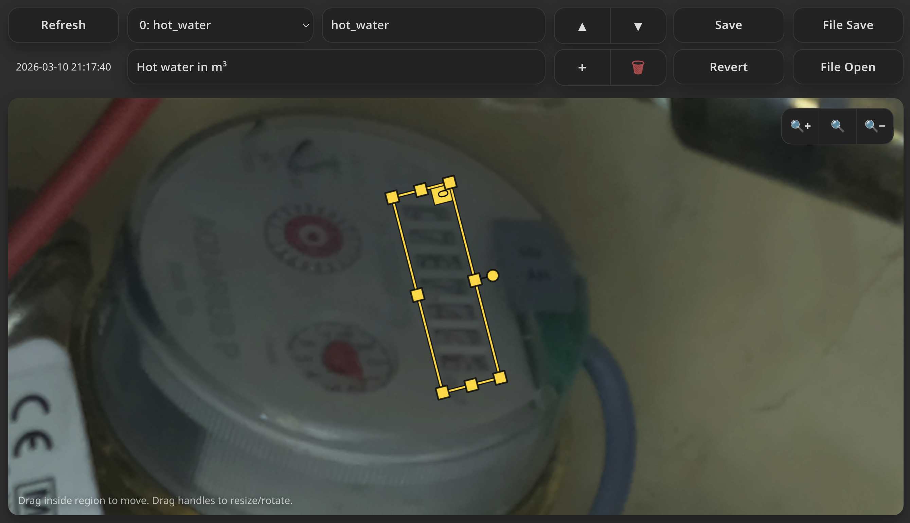

# Camera Region Server

HTTP server for triggering camera captures, storing region definitions, and serving full/region JPEG images via a simple `api/v1` interface.

This project includes:
- `camera-region-server.py`: production-style server (Tornado + Pillow).
- `mock-camera-region-server.py`: mock server for UI/API testing without camera hardware.
- `camera-region-editor.html`: browser UI for defining and editing regions.
- `camera-server-region-api-v1.md`: API specification.

## Features

- Start async captures with status polling.
- Serve full-frame JPEG images.
- Serve cropped/rotated region JPEG images by region `index` or `name`.
- Persist region definitions to JSON with ETag/If-Match concurrency control.
- Optional static file serving (for the bundled editor or other assets).
- RFC-style `application/problem+json` error responses.

## Requirements

- Python 3.10+
- `tornado`
- `Pillow`
- A capture command (default: `take_picture.sh`) that:
  - accepts one argument: output JPEG path
  - exits `0` on success
  - writes a valid JPEG file to that path

## Installation

```bash
python3 -m venv .venv
source .venv/bin/activate
pip install tornado pillow
```

## Quick Start (Real Server)

1. Create a minimal capture command:

```bash
cat > take_picture.sh <<'EOF'
#!/usr/bin/env bash
set -euo pipefail
out="$1"
# Replace this with your camera command.
cp sample.jpg "$out"
EOF
chmod +x take_picture.sh
```

2. Start the server:

```bash
./camera-region-server.py \
  --host 127.0.0.1 \
  --port 8080 \
  --regions-file ./regions.json \
  --static-dir . \
  --take-picture-cmd ./take_picture.sh
```

3. Open the editor:

`http://127.0.0.1:8080/camera-region-editor.html`

## Quick Start (Mock Server)

Use this for frontend/API flow testing when camera hardware is unavailable.

```bash
./mock-camera-region-server.py \
  --host 127.0.0.1 \
  --port 8080 \
  ./camera-region-editor.html \
  ./sample.jpg
```

The mock serves:
- `GET /index.html`
- `POST /api/v1/captures`
- `GET /api/v1/captures/*`
- `GET /api/v1/images/full`
- `GET/PUT /api/v1/regions`

## Main API Endpoints

Base path: `/api/v1`

- `POST /captures`
  - start capture
  - returns `201` or `202` and `Location`
- `GET /captures/{capture_id}`
  - capture status: `processing`, `ready`, or `failed`
- `GET /images/full?capture_id=&new_capture=&wait=`
  - full JPEG image
  - supports blocking/non-blocking behavior
- `GET /images/region?index=|name=&capture_id=&wait=&source=`
  - region JPEG image
- `GET /regions`
  - current region config + ETag
- `PUT /regions`
  - replace full region config (`Content-Type: application/json`)
  - supports `If-Match` precondition

See full contract and status code details in `camera-server-region-api-v1.md`.

## Region JSON Format

`PUT /api/v1/regions` expects:

```json
{
  "regions": [
    {
      "name": "water_meter_left",
      "description": "Left meter register",
      "geometry": {
        "cx": 1520.5,
        "cy": 780.25,
        "width": 640,
        "height": 320,
        "rotation_deg": -1.25
      }
    }
  ]
}
```

Validation highlights:
- `name` must match `^[A-Za-z_][A-Za-z0-9_]*$` and be unique.
- `description` max length is 256.
- `width`/`height` must be positive integers.
- Region sampling outside source image bounds returns `422`.

## Useful cURL Examples

Start capture:

```bash
curl -i -X POST http://127.0.0.1:8080/api/v1/captures
```

Get latest full image, forcing a new capture:

```bash
curl -fS "http://127.0.0.1:8080/api/v1/images/full?new_capture=true&wait=true" -o full.jpg
```

Get region by name from latest capture:

```bash
curl -fS "http://127.0.0.1:8080/api/v1/images/region?name=water_meter_left&wait=true" -o region.jpg
```

Read and update regions with ETag:

```bash
etag=$(curl -si http://127.0.0.1:8080/api/v1/regions | awk -F': ' '/^ETag:/{print $2}' | tr -d '\r')
curl -fS -X PUT \
  -H "Content-Type: application/json" \
  -H "If-Match: $etag" \
  --data @regions.json \
  http://127.0.0.1:8080/api/v1/regions
```

## CLI Options (`camera-region-server.py`)

```text
--host               Bind host (default: 127.0.0.1)
--port               Bind port (default: 8080)
--regions-file       Regions JSON path (default: ./regions.json)
--static-dir         Optional static document root
--capture-dir        Capture output root (default: <tempdir>/camera-server)
--take-picture-cmd   Capture command (default: take_picture.sh)
--wait-timeout       Blocking wait timeout in seconds (default: 15)
```

## Notes

- This API is intended to run behind an HTTPS reverse proxy that handles auth/TLS.
- Captures and derived region files are stored under `--capture-dir`.
- Non-API routes are served from `--static-dir` when configured.

## Screenshot

Example of the browser-based region editor:


